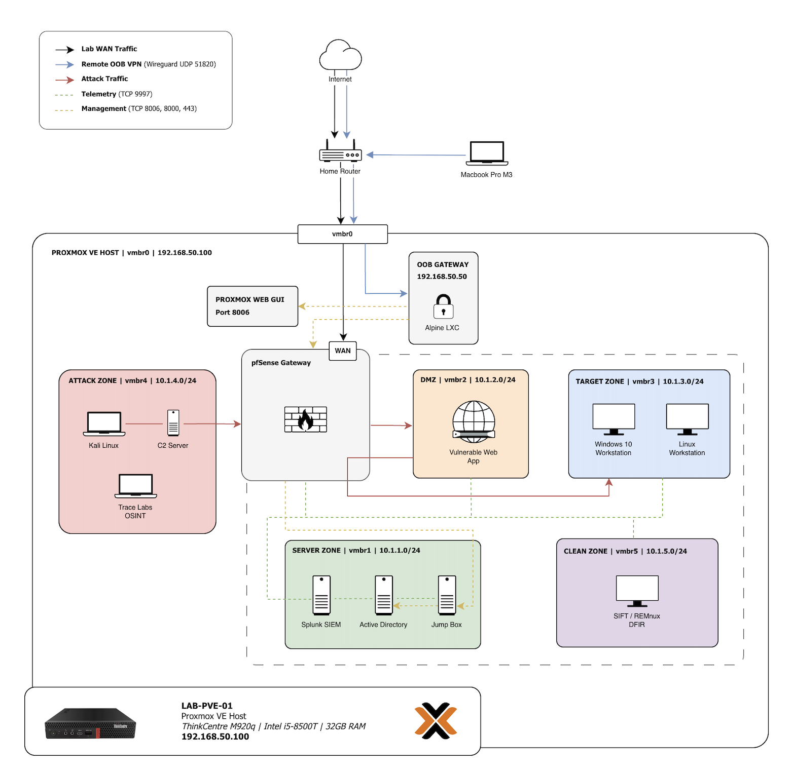
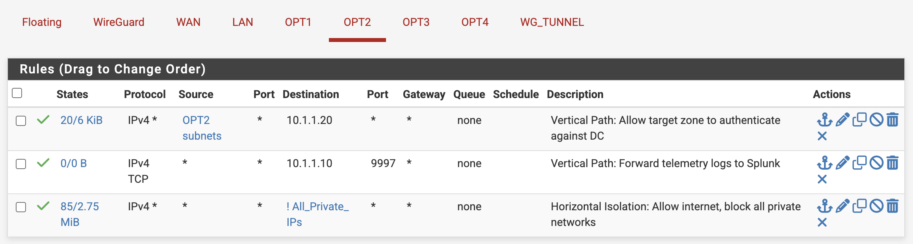
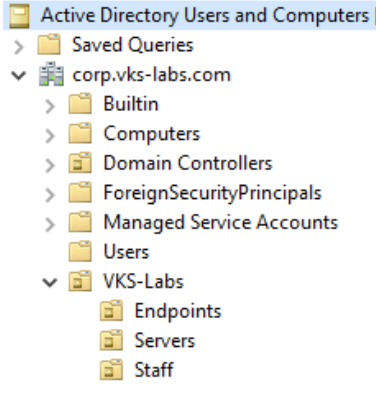
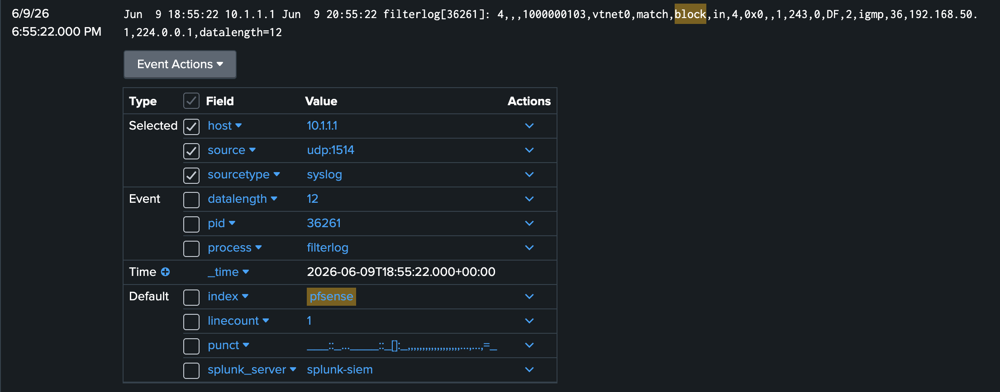

# Project 1: Secure Enterprise Cyber Lab (pfSense, Active Directory & Splunk)

A fully isolated, multi-tenant enterprise cyber lab built on Proxmox VE featuring virtual network segmentation, centralized pfSense routing, an Active Directory domain, a dedicated Splunk SIEM pipeline, and an isolated malware analysis clean room.

---

## 🏗️ Network Architecture & Asset Inventory



### Lab Subnets & Asset Mapping

| Hostname | OS | IP Address | Subnet / Zone | Role |
| --- | --- | --- | --- | --- |
| `pfSense` | FreeBSD | `10.1.x.1` | Core Gateway | Central Router & Policy Firewall

 |
| `oob-gateway` | Alpine Linux | `192.168.50.50` | Out-of-Band | WireGuard LXC Remote Management

 |
| `splunk-siem` | Ubuntu Server | `10.1.1.10` | Server Vault (LAN) | Central Log Indexer & Analytics

 |
| `dc01` | Windows Server 2022 | `10.1.1.20` | Server Vault (LAN) | Active Directory Domain Controller

 |
| `jumpbox-01` | Windows 10 | `10.1.1.50` | Server Vault (LAN) | Hardened Management Workstation

 |
| `vuln-web` | Ubuntu Server | `10.1.2.10` | DMZ (OPT1) | Dockerized Vulnerable Web Host (DVWA)

 |
| `win10-client01` | Windows 10 | `10.1.3.100` | Target Zone (OPT2) | Domain-joined AD Endpoint

 |
| `linux-client01` | Ubuntu Desktop | `10.1.3.150` | Target Zone (OPT2) | Linux Target Workstation

 |
| `kali-attack` | Kali Linux | `10.1.4.100` | Attack Zone (OPT3) | Primary Adversary Emulation Workstation

 |
| `c2-server` | Ubuntu Server | `10.1.4.150` | Attack Zone (OPT3) | Command & Control (Sliver C2)

 |
| `osint` | Trace Labs OSINT | `10.1.4.200` | Attack Zone (OPT3) | Target Profiling Workstation

 |
| `dfir-remnux` | REMnux | `10.1.5.100` | Clean Zone (OPT4) | Offline Malware Analysis Clean Room

 |

---

## 📁 Repository Structure

```text
project1-cyber-lab-infrastructure/
├── assets/
│   └── network-topology.png             # Full multi-zone topology diagram
├── configs/
│   ├── inputs.conf                      # Splunk UF log channels & event ID blacklists
│   ├── lxc-wireguard-passthrough.conf   # Alpine LXC /dev/net/tun passthrough settings
│   └── netplan-static-ip.yaml           # Netplan network configs for Linux hosts
├── scripts/
│   └── ad-management-launcher.ps1       # Non-domain-joined AD admin launcher
└── README.md                            # Comprehensive engineering writeup

```

---

## Module 1: Infrastructure, Routing & Isolation

### Hypervisor Setup & Storage Architecture

* **Hardware:** Deployed on a Lenovo ThinkCentre M920q mini-PC running Proxmox VE.

* **Storage Allocation:** Core infrastructure (`pfSense`, `dc01`) runs on internal storage to prevent Active Directory database corruption during disk disconnects. Secondary workloads (`splunk-siem`, client workstations) run on an external 1TB Samsung T7 SSD formatted as `ext4` and mounted via `/etc/fstab` with the `nofail` flag.


### Network Segmentation & Gateways

* **Proxmox Virtual Bridges:** Built five isolated virtual switches (`vmbr1` through `vmbr5`) completely unbridged from the physical LAN.

* **pfSense Central Firewall:** Serves as default gateway for all lab zones. Configured an `All_Private_IPs` firewall alias covering all internal subnets.



* **Isolation Rules:** Implemented a two-rule default policy across subnets:
1. Pass telemetry traffic to Splunk (`10.1.1.10:9997`).
2. Allow outbound WAN internet traffic while blocking all destinations matching `All_Private_IPs`.


### Out-of-Band (OOB) Remote Access

* Configured an unprivileged Alpine Linux WireGuard container (`oob-gateway`) at `192.168.50.50` on `vmbr0`.
* **LXC Device Passthrough:** Enabled `/dev/net/tun` device passthrough in Proxmox (`/etc/pve/lxc/101.conf`) to allow WireGuard interface binding while keeping the container unprivileged:
```text
lxc.cgroup2.devices.allow: c 10:200 rwm
lxc.mount.entry: /dev/net dev/net none bind,create=dir

```
* **Routing Fix:** Added `up ip route add 10.1.0.0/16 via 192.168.50.42` in `/etc/network/interfaces` to allow return traffic from internal lab subnets.
* **WAN Boundary:** Restricted pfSense WebGUI access strictly to the WireGuard gateway IP (`192.168.50.50`) on WAN port 443.


---

## Module 2: Enterprise Vault Services

### Active Directory Domain Controller (`dc01`)

* Deployed Windows Server 2022 (`10.1.1.20`) as domain controller for `corp.vks-labs.com`.
* **VirtIO Drivers:** Mounted `virtio-win.iso` to install network interface drivers during offline installation.
* **OU Structure:** Configured `VKS-Labs` Organizational Units separating `Endpoints`, `Servers`, and `Staff`.



### Hardened Administration Jump Box (`jumpbox-01`)

* Built an unjoined Windows 10 admin workstation at `10.1.1.50`. Keeping the jump box unjoined prevents Domain Admin credential caching in memory.


* Used a custom launcher script (`ad-management-launcher.ps1`) to securely invoke Remote Server Administration Tools (RSAT) via explicit network tokens.


### Central Log Indexer (`splunk-siem`)

* Deployed Splunk Enterprise on Ubuntu Server at `10.1.1.10`.

* **Keyboard Layout Fix:** Resolved installer layout mismatch by reconfiguring Swedish locale over SSH (`dpkg-reconfigure keyboard-configuration`).

* **Storage & Inputs:** Provisioned indexed volume limits (Firewall: 100 GB; Windows/Linux: 50 GB each). Set up a UDP syslog listener on port 1514 to bypass root permission locks on port 514. Pointed pfSense remote logging to `10.1.1.10:1514`.



---

## Module 3: Target Environments & Telemetry Onboarding

### DMZ Vulnerable Web Host (`vuln-web`)

* Provisioned Ubuntu Server (`10.1.2.10`) on DMZ (`vmbr2`) running Docker with Damn Vulnerable Web Application (`vulnerables/web-dvwa`) on port 80.


* **Netplan Fix:** Swapped DHCP for static configuration in `/etc/netplan/50-cloud-init.yaml` pointing DNS to gateway `10.1.2.1` to resolve update repository build failures.


### Windows Target Onboarding & Troubleshooting (`win10-client01`)

* Deployed Windows 10 at `10.1.3.100` on `vmbr3`.


* **Firewall Rule Ordering:** Resolved AD domain join timeouts by adding a top-priority pass rule on OPT2 permitting domain authentication traffic to `10.1.1.20`.

* **Active Directory Clock Sync:** Resolved Group Policy update failures caused by time drift between the hypervisor motherboard and domain controller by running:

```cmd
net time \\10.1.1.20 /set /y
gpupdate /force
```


* **GPO Inheritance:** Moved computer objects from the default `Computers` container into `OU=Endpoints,OU=VKS-Labs` to enable GPO enforcement for PowerShell Script Block and Module Logging.

* **DC Universal Forwarder Installation:** Solved installer rollback crashes on `dc01` by selecting **Local System** instead of "Virtual Account" to grant the service rights to performance monitoring groups.

* **Splunk License Tuning:** Suppressed high-volume noise (Windows Filtering Platform connection events) on `dc01` by adding event blacklists in `inputs.conf`:


```
[WinEventLog://Security]
index = windows
disabled = false
blacklist1 = EventCode="(5156|5158|4656|4658|4690|4907)"
```

### Linux Endpoint Hardening (`linux-client01`)

* Configured Splunk Universal Forwarder on Ubuntu Desktop (`10.1.3.150`) under a unprivileged `splunkfwd` service account.


* **Secure Log Reading:** Applied POSIX Access Control Lists to permit log reading without granting elevated root privileges:


```bash
sudo setfacl -m u:splunkfwd:r /home/nix-localadmin/.bash_history
```

---

## Module 4: Adversary Emulation & Isolation Validation

### Attack Zone Infrastructure (`vmbr4`)

1. **Primary Attacker Workstation:** Kali Linux (`10.1.4.100`) configured with SSH remote access.


2. **C2 Framework Host:** Ubuntu Server (`10.1.4.150`) running Sliver C2 framework (`v1.7.3`) and `mingw-w64` cross-compiler.


3. **OSINT Workstation:** Trace Labs OSINT VM (`10.1.4.200`) imported via `qm importdisk` onto `samsung-t7` storage. Resolved Proxmox OVA download resolution failures by adding secondary DNS (`1.1.1.1`) in hypervisor host settings.


### Malware Clean Room (`dfir-remnux`)

* Deployed REMnux (`10.1.5.100`) on isolated Clean Zone (`vmbr5`).

* **SSH Host Key Generation:** Resolved failed SSH service initialization by generating unique host keys:


```bash
sudo ssh-keygen -A
sudo systemctl enable --now ssh
```

* **Hardened Netplan Permissions:** Fixed file permission warnings by enforcing owner-only read rights:


```bash
sudo chmod 600 /etc/netplan/01-netcfg.yaml
sudo ip addr flush dev ens18 && sudo netplan apply
```

### Network Boundary & Isolation Checks

```text
[ Test Case ]                     [ Expected Outcome ]                      [ Status ]
--------------------------------------------------------------------------------------
Kali -> DMZ (10.1.2.10:80)        HTTP 302 / 200 Success                   [ PASSED ]
Kali -> DC (10.1.1.20) Ping       100% Packet Loss (Blocked by pfSense)    [ PASSED ]
Kali -> Splunk (10.1.1.10:8000)   Connection Timed Out                     [ PASSED ]
REM-nux -> Internet (1.1.1.1)     100% Packet Loss (Complete Egress Block) [ PASSED ]
REM-nux -> Splunk (10.1.1.10:9997) TCP Port Open (Telemetry Streaming)      [ PASSED ]
```

* **Verification Execution:**
  * **DMZ Access:** Executing `curl -I http://10.1.2.10` from Kali returned HTTP 302 after applying the OPT3 HTTP pass rule.
  * **Internal Block:** Pinging `10.1.1.20` resulted in 100% loss, and `nc -zvw3 10.1.1.10 8000` timed out, confirming lateral isolation.
  * **Clean Room Quarantine:** Running `ping -c 3 1.1.1.1` from REMnux confirmed 100% loss, while `nc -zvw3 10.1.1.10 9997` returned `open`.

---

## 💾 Storage Conversion & Snapshot Management

### RAW to QCOW2 Disk Conversion
To enable Proxmox directory storage snapshotting, VM disk images were converted from RAW to QCOW2 format via the Proxmox CLI:

```bash
qm disk move 111 scsi0 samsung-t7 format qcow2 --delete 1
```

### Baseline Snapshot Policy (`Clean-Base`)
Established a standardized baseline state across all lab VMs (`sec-pfsense`, `sec-splunk`, `win10-client01`, `kali-attacker01`, `dfir-remnux`).
* **Snapshot Setting:** Unchecked **Include RAM** on all snapshots to maintain minimal storage footprints, guarantee rapid rollback times, and prevent stale socket restoration issues.

```